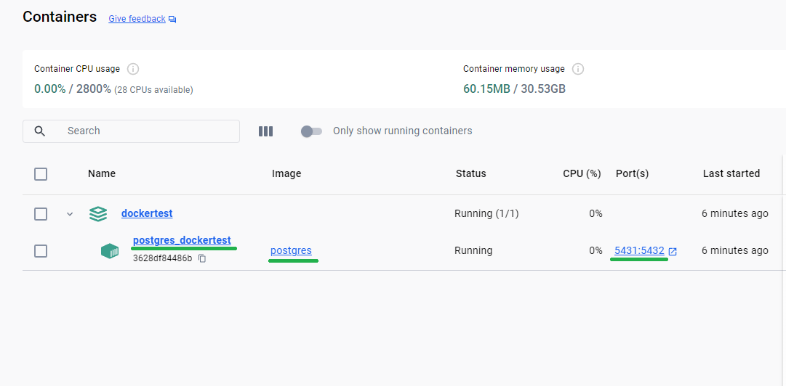
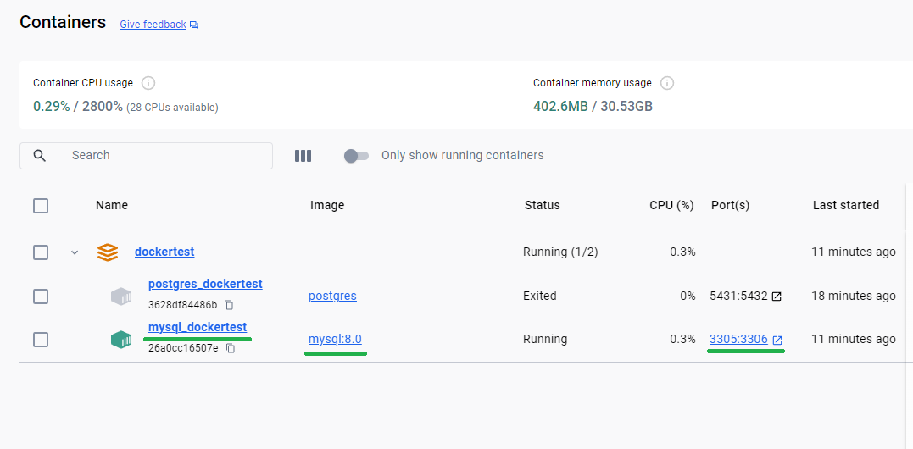

## Docker para Desenvolvedor

::: info :warning:
Este projeto não é um curso ou um guia, apenas faço anotações pessoais para referência rápida.
:::

## Usando banco de dados com Docker

Nestas anotações, vou criar um arquivo `docker-compose.yml` ou um arquivo YAML específico para configurar e executar um MySQL ou PostgreSQL.

:warning: Em ambos os exemplos, estamos alterando as portas padrão para evitar conflitos caso outra instância do mesmo banco de dados ou contêiner já esteja em execução nas portas padrão. Ao especificar portas diferentes, garantimos que nossos contêineres Docker possam coexistir pacificamente sem encontrar conflitos de porta. Essa prática é especialmente útil em ambientes de desenvolvimento onde vários serviços podem estar em execução simultaneamente.

### Configuração do PostgreSQL com Docker

This section can include all the instructions and configurations related to setting up PostgreSQL using Docker.
Esta seção incluei as instruções e configurações relacionadas à configuração do PostgreSQL usando Docker.

```YAML
version: '3.8'

services:
  postgres_dockertest:
    container_name: postgres_dockertest
    image: postgres
    ports:
      - 5431:5432    # Alterando a porta padrão 5432 para a porta 5431.
    environment:
      - POSTGRES_USER=admin
      - POSTGRES_PASSWORD=admin
      - POSTGRES_DB=dockertest
```

Duas maneiras de iniciar este arquivo YAML

- `docker-compose up -d` se o arquivo tiver o nome padrão `docker-compose.yml`

- `docker-compose -f docker-compose-PostgreSQL.yml up -d` se o arquivo tiver um nome específico como `docker-compose-PostgreSQL.yml`

```txt {1}
PS C:\GitHub\dockertest> docker-compose -f docker-compose-PostgreSQL.yml up -d
[+] Running 1/2
 - Network dockertest_default     Created   0.9s 
 ✔ Container postgres_dockertest  Started   0.8s 
PS C:\GitHub\dockertest> 
```



```properties:line-numbers {3-5} [application.properties]
server.port=8085

spring.datasource.url=jdbc:postgresql://localhost:5431/dockertest
spring.datasource.username=admin
spring.datasource.password=admin

spring.jpa.properties.hibernate.dialect=org.hibernate.dialect.PostgreSQLDialect
spring.jpa.hibernate.ddl-auto=update
spring.jpa.show-sql=true
spring.jpa.properties.hibernate.format_sql=true
```

### Configuração do MySQL com Docker

Similarly, this section can encompass all the details and steps required for setting up MySQL using Docker.

```YAML
version: '3.8'

services:
  mysql_dockertest:
    container_name: mysql_dockertest
    image: mysql:8.0
    ports:
      - 3305:3306   # Changing the default port 3306 to port 3305.
    environment:
      - MYSQL_ROOT_PASSWORD=admin
      - MYSQL_DATABASE=dockertest
    volumes:
      - mysql_data:/var/lib/mysql

volumes:
  mysql_data:
```

Two ways to start this YAML file

- `docker-compose up -d` if the file has default name `docker-compose.yml`

- `docker-compose -f docker-compose-MySQL.yml up -d` if the file has a specific name like  `docker-compose-MySQL.yml`

```txt {1}
PS C:\GitHub\dockertest> docker-compose -f docker-compose-MySQL.yml up -d
[+] Running 1/1
 ✔ Container mysql_dockertest  Started   0.4s 
PS C:\GitHub\dockertest> 
```



```properties:line-numbers {3-6} [application.properties]
server.port=8085

spring.datasource.url=jdbc:mysql://localhost:3305/dockertest
spring.datasource.username=root
spring.datasource.password=admin
spring.datasource.driver-class-name=com.mysql.cj.jdbc.Driver

spring.jpa.properties.hibernate.dialect=org.hibernate.dialect.MySQL8Dialect
spring.jpa.hibernate.ddl-auto=update
spring.jpa.show-sql=true
spring.jpa.properties.hibernate.format_sql=true
```

::: details :warning: For DBeaver users

1. Right-click on your connection and select "Edit Connection".
2. In the "Connection Settings" screen, navigate to "Driver Properties".
3. Right-click on the "user properties" area and choose "Add new property".
4. Add the following two properties:

   - **Property Name:** `useSSL`
     **Value:** `false`

   - **Property Name:** `allowPublicKeyRetrieval`
     **Value:** `true`

Source: [Alura Forum](https://cursos.alura.com.br/forum/topico-erro-public-key-retrieval-is-not-allowed-ao-fazer-test-connection-no-dbeaver-como-resolver-137427)
:::

## Teste

::: code-group

```java [StartApplication.java]
package br.com.rasiaink.dockertest;

import br.com.rasiaink.dockertest.model.User;
import br.com.rasiaink.dockertest.repository.UserRepository;
import org.springframework.beans.factory.annotation.Autowired;
import org.springframework.boot.CommandLineRunner;
import org.springframework.stereotype.Component;

@Component
public class StartApplication implements CommandLineRunner {
    @Autowired
    private UserRepository repository;

    @Override
    public void run(String... args) throws Exception {
        User user = new User();
        user.setName("Tiago");
        user.setUsername("rasia83");
        user.setPassword("123456-don't-do-it");

        repository.save(user);

        for(User u: repository.findAll()){
            System.out.println(u);
        }

    }
}
```

```java [User.java]
package br.com.rasiaink.dockertest.model;

import jakarta.persistence.*;
import lombok.*;
import org.hibernate.proxy.HibernateProxy;

import java.util.Objects;

@Entity
@Table(name = "tab_user")
@Getter
@Setter
@ToString
@AllArgsConstructor
@NoArgsConstructor
public class User {

    @Id
    @GeneratedValue(strategy = GenerationType.IDENTITY)
    @Column(name = "id_user")
    private Integer id;

    @Column(length = 50, nullable = false)
    private String name;

    @Column(length = 50, nullable = false)
    private String username;

    @Column(length = 50, nullable = false)
    private String password;

    public User(String username) {
        this.username = username;
    }

    @Override
    public final boolean equals(Object o) {
        if (this == o) return true;
        if (o == null) return false;
        Class<?> oEffectiveClass = o instanceof HibernateProxy ? ((HibernateProxy) o).getHibernateLazyInitializer().getPersistentClass() : o.getClass();
        Class<?> thisEffectiveClass = this instanceof HibernateProxy ? ((HibernateProxy) this).getHibernateLazyInitializer().getPersistentClass() : this.getClass();
        if (thisEffectiveClass != oEffectiveClass) return false;
        User user = (User) o;
        return getId() != null && Objects.equals(getId(), user.getId());
    }

    @Override
    public final int hashCode() {
        return this instanceof HibernateProxy ? ((HibernateProxy) this).getHibernateLazyInitializer().getPersistentClass().hashCode() : getClass().hashCode();
    }
}
```

```java [UserRepository.java]
package br.com.rasiaink.dockertest.repository;

import br.com.rasiaink.dockertest.model.User;
import org.springframework.data.jpa.repository.JpaRepository;

public interface UserRepository extends JpaRepository<User, Integer> {
}
```

```java [UserService.java]
package br.com.rasiaink.dockertest.service;

import br.com.rasiaink.dockertest.model.User;
import org.springframework.stereotype.Service;
import java.util.ArrayList;
import java.util.List;

@Service
public class UserService {

    //simulando um banco de dados com a tabela user
    private List<User> database = new ArrayList<>();

    public void gravar(User user){
        database.add(user);
    }
    public void alterar(User user){
        int index = database.indexOf(user);
        database.set(index,user);
    }
    public User buscarPorUsername(String username){
        int index = database.indexOf(new User(username));
        User selectUser = database.get(index);
        return selectUser;
    }
    public List<User> listar(){
        return database;
    }

}
```

:::

## Result


## Extra

### Add a .sql file to start with MySQL and an exemple to create a user

First create a .SQL file in the same folder as Docker YAML file.

For this sample to add a user in MySQL, I'll create a `create-user.sql`

```SQL [create-user.sql]
CREATE USER IF NOT EXISTS 'developer'@'%' IDENTIFIED BY 'dev123';
GRANT ALL PRIVILEGES ON dockertest.* TO 'developer'@'%';
FLUSH PRIVILEGES;
```

Now change my docker file to add this SQL file.

```YAML {12,15}
version: '3.8'

services:
  mysql_dockertest:
    container_name: mysql_dockertest
    image: mysql:8.0
    ports:
      - 3305:3306   # Changing the default port 3306 to port 3305.
    environment:
      - MYSQL_ROOT_PASSWORD=admin
      - MYSQL_DATABASE=dockertest
      - MYSQL_INIT_SQL=/docker-entrypoint-initdb.d/init.sql  // [!code focus]
    volumes:
      - mysql_data:/var/lib/mysql
      - ./create-user.sql:/docker-entrypoint-initdb.d/init.sql  // [!code focus]
```

### application.properties with the new user

```properties  [application.properties]
server.port=8085

spring.datasource.url=jdbc:mysql://localhost:3305/dockertest
spring.datasource.username=developer  // [!code focus]
spring.datasource.password=dev123  // [!code focus]
spring.datasource.driver-class-name=com.mysql.cj.jdbc.Driver

spring.jpa.properties.hibernate.dialect=org.hibernate.dialect.MySQL8Dialect
spring.jpa.hibernate.ddl-auto=update
spring.jpa.show-sql=true
spring.jpa.properties.hibernate.format_sql=true
```
