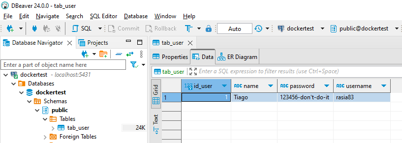
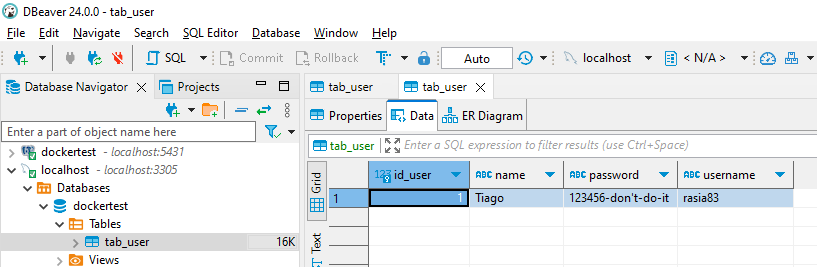

## Docker for Developer

::: info :warning:
This project is not a course or a guide, I just take personal notes for a quick reference.
:::

## Using database with docker

In this notes I’ll create a `docker-compose.yml` file or a specific name YAML file to set up and run a MySQL or PostgreSQL.

:warning: In both examples, we are changing the default ports to avoid conflicts if another instance of the same database or container is already running on the default ports. By specifying different ports, we ensure that our Docker containers can coexist peacefully without encountering port conflicts. This practice is especially useful in development environments where multiple services may be running simultaneously.

### PostgreSQL Setup with Docker

This section can include all the instructions and configurations related to setting up PostgreSQL using Docker.

```YAML
version: '3.8'

services:
  postgres_dockertest:
    container_name: postgres_dockertest
    image: postgres
    ports:
      - 5431:5432    # Changing the default port 5432 to port 5431.
    environment:
      - POSTGRES_USER=admin
      - POSTGRES_PASSWORD=admin
      - POSTGRES_DB=dockertest
```

Two ways to start this YAML file

- `docker-compose up -d` if the file has default name `docker-compose.yml`

- `docker-compose -f docker-compose-PostgreSQL.yml up -d` if the file has a specific name like  `docker-compose-PostgreSQL.yml`

```txt {1}
PS C:\GitHub\dockertest> docker-compose -f docker-compose-PostgreSQL.yml up -d
[+] Running 1/2
 - Network dockertest_default     Created   0.9s 
 ✔ Container postgres_dockertest  Started   0.8s 
PS C:\GitHub\dockertest> 
```


```properties:line-numbers {3-5} [application.properties]
server.port=8085

spring.datasource.url=jdbc:postgresql://localhost:5431/dockertest
spring.datasource.username=admin
spring.datasource.password=admin

spring.jpa.properties.hibernate.dialect=org.hibernate.dialect.PostgreSQLDialect
spring.jpa.hibernate.ddl-auto=update
spring.jpa.show-sql=true
spring.jpa.properties.hibernate.format_sql=true
```

### MySQL Setup with Docker

Similarly, this section can encompass all the details and steps required for setting up MySQL using Docker.

```YAML
version: '3.8'

services:
  mysql_dockertest:
    container_name: mysql_dockertest
    image: mysql:8.0
    ports:
      - 3305:3306   # Changing the default port 3306 to port 3305.
    environment:
      - MYSQL_ROOT_PASSWORD=admin
      - MYSQL_DATABASE=dockertest
    volumes:
      - mysql_data:/var/lib/mysql

volumes:
  mysql_data:
```

Two ways to start this YAML file

- `docker-compose up -d` if the file has default name `docker-compose.yml`

- `docker-compose -f docker-compose-MySQL.yml up -d` if the file has a specific name like  `docker-compose-MySQL.yml`

```txt {1}
PS C:\GitHub\dockertest> docker-compose -f docker-compose-MySQL.yml up -d
[+] Running 1/1
 ✔ Container mysql_dockertest  Started   0.4s 
PS C:\GitHub\dockertest> 
```


```properties:line-numbers {3-6} [application.properties]
server.port=8085

spring.datasource.url=jdbc:mysql://localhost:3305/dockertest
spring.datasource.username=root
spring.datasource.password=admin
spring.datasource.driver-class-name=com.mysql.cj.jdbc.Driver

spring.jpa.properties.hibernate.dialect=org.hibernate.dialect.MySQL8Dialect
spring.jpa.hibernate.ddl-auto=update
spring.jpa.show-sql=true
spring.jpa.properties.hibernate.format_sql=true
```

::: details :warning: For DBeaver users

1. Right-click on your connection and select "Edit Connection".
2. In the "Connection Settings" screen, navigate to "Driver Properties".
3. Right-click on the "user properties" area and choose "Add new property".
4. Add the following two properties:

   - **Property Name:** `useSSL`
     **Value:** `false`

   - **Property Name:** `allowPublicKeyRetrieval`
     **Value:** `true`

Source: [Alura Forum](https://cursos.alura.com.br/forum/topico-erro-public-key-retrieval-is-not-allowed-ao-fazer-test-connection-no-dbeaver-como-resolver-137427)
:::

## Test

::: code-group

```java [StartApplication.java]
package br.com.rasiaink.dockertest;

import br.com.rasiaink.dockertest.model.User;
import br.com.rasiaink.dockertest.repository.UserRepository;
import org.springframework.beans.factory.annotation.Autowired;
import org.springframework.boot.CommandLineRunner;
import org.springframework.stereotype.Component;

@Component
public class StartApplication implements CommandLineRunner {
    @Autowired
    private UserRepository repository;

    @Override
    public void run(String... args) throws Exception {
        User user = new User();
        user.setName("Tiago");
        user.setUsername("rasia83");
        user.setPassword("123456-don't-do-it");

        repository.save(user);

        for(User u: repository.findAll()){
            System.out.println(u);
        }

    }
}
```

```java [User.java]
package br.com.rasiaink.dockertest.model;

import jakarta.persistence.*;
import lombok.*;
import org.hibernate.proxy.HibernateProxy;

import java.util.Objects;

@Entity
@Table(name = "tab_user")
@Getter
@Setter
@ToString
@AllArgsConstructor
@NoArgsConstructor
public class User {

    @Id
    @GeneratedValue(strategy = GenerationType.IDENTITY)
    @Column(name = "id_user")
    private Integer id;

    @Column(length = 50, nullable = false)
    private String name;

    @Column(length = 50, nullable = false)
    private String username;

    @Column(length = 50, nullable = false)
    private String password;

    public User(String username) {
        this.username = username;
    }

    @Override
    public final boolean equals(Object o) {
        if (this == o) return true;
        if (o == null) return false;
        Class<?> oEffectiveClass = o instanceof HibernateProxy ? ((HibernateProxy) o).getHibernateLazyInitializer().getPersistentClass() : o.getClass();
        Class<?> thisEffectiveClass = this instanceof HibernateProxy ? ((HibernateProxy) this).getHibernateLazyInitializer().getPersistentClass() : this.getClass();
        if (thisEffectiveClass != oEffectiveClass) return false;
        User user = (User) o;
        return getId() != null && Objects.equals(getId(), user.getId());
    }

    @Override
    public final int hashCode() {
        return this instanceof HibernateProxy ? ((HibernateProxy) this).getHibernateLazyInitializer().getPersistentClass().hashCode() : getClass().hashCode();
    }
}
```

```java [UserRepository.java]
package br.com.rasiaink.dockertest.repository;

import br.com.rasiaink.dockertest.model.User;
import org.springframework.data.jpa.repository.JpaRepository;

public interface UserRepository extends JpaRepository<User, Integer> {
}
```

:::

## Result





## Extra 1

### Add a .sql file to start with MySQL and an exemple to create a user

First create a .SQL file in the same folder as Docker YAML file.

For this sample to add a user in MySQL, I'll create a `create-user.sql`

```SQL [create-user.sql]
CREATE USER IF NOT EXISTS 'developer'@'%' IDENTIFIED BY 'dev123';
GRANT ALL PRIVILEGES ON dockertest.* TO 'developer'@'%';
FLUSH PRIVILEGES;
```

Now change my docker file to add this SQL file.

```YAML {12,15}
version: '3.8'

services:
  mysql_dockertest:
    container_name: mysql_dockertest
    image: mysql:8.0
    ports:
      - 3305:3306   # Changing the default port 3306 to port 3305.
    environment:
      - MYSQL_ROOT_PASSWORD=admin
      - MYSQL_DATABASE=dockertest
      - MYSQL_INIT_SQL=/docker-entrypoint-initdb.d/init.sql  // [!code focus]
    volumes:
      - mysql_data:/var/lib/mysql
      - ./create-user.sql:/docker-entrypoint-initdb.d/init.sql  // [!code focus]
```

### application.properties with the new user

```properties  [application.properties]
server.port=8085

spring.datasource.url=jdbc:mysql://localhost:3305/dockertest
spring.datasource.username=developer  // [!code focus]
spring.datasource.password=dev123  // [!code focus]
spring.datasource.driver-class-name=com.mysql.cj.jdbc.Driver

spring.jpa.properties.hibernate.dialect=org.hibernate.dialect.MySQL8Dialect
spring.jpa.hibernate.ddl-auto=update
spring.jpa.show-sql=true
spring.jpa.properties.hibernate.format_sql=true
```

## Extra 2

### Neo4J

```YAML
version: "3.8"

services:
  neo4j:
    image: neo4j:community
    ports:
      - 7474:7474
      - 7687:7687
      # This binds two ports (7474 and 7687) for HTTP and Bolt access to the Neo4j API.
      # which allows you to access neo4j through your browser at http://localhost:7474
    restart: unless-stopped
    environment:
      - NEO4J_AUTH=neo4j/password  # login / password
    volumes:
      - ./db/data:/data
      - ./db/conf:/conf
      - ./db/logs:/logs
      - ./db/plugins:/plugins
```

### gvenzl/oracle-xe

[COMO RODAR O ORACLE NO DOCKER... CONEXÃO COM SQL DEVELOPER](https://www.youtube.com/watch?v=j-FXrFHg8QE)


```YAML
version: "3.7"

services:
  oracle-server-db:
    container_name: oracle-server-db
    image: gvenzl/oracle-xe
    ports:
      - 1521:1521
    enviroment:
      ORACLE_PASSWORD: "Senha@1234"
```
