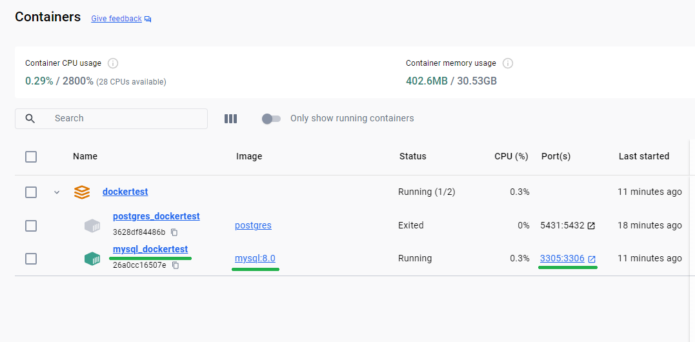

## Docker for Developer

::: info
This project is not a course or a guide, I just take personal notes for a quick reference.
:::

### Using database with docker

In this notes I’ll create a `docker-compose.yml` file or a specific name yml file to set up and run a MySQL or PostgreSQL.

In both examples will change default port, that’s good if I have DB installed or another container running.

#### PostgreSQL

```yml
version: '3.8'

services:
  postgres_dockertest:
    container_name: postgres_dockertest
    image: postgres
    ports:
      - 5431:5432    # alterando a porta padrão 5432 para a porta 5431
    environment:
      - POSTGRES_USER=admin
      - POSTGRES_PASSWORD=admin
      - POSTGRES_DB=dockertest
```

Two ways to start this yml file

- `docker-compose up -d ` if the file has default name `docker-compose.yml`

- `docker-compose -f docker-compose-PostgreSQL.yml up -d` if the file has a specific name like  `docker-compose-PostgreSQL.yml`

```txt {1}
PS C:\GitHub\dockertest> docker-compose -f docker-compose-PostgreSQL.yml up -d
[+] Running 1/2
 - Network dockertest_default     Created                                                                                                                                                                                      0.9s 
 ✔ Container postgres_dockertest  Started                                                                                                                                                                                      0.8s 
PS C:\GitHub\dockertest> 
```


```properties:line-numbers {3-5} [application.properties]
server.port=8085

spring.datasource.url=jdbc:postgresql://localhost:5431/dockertest
spring.datasource.username=admin
spring.datasource.password=admin

spring.jpa.properties.hibernate.dialect=org.hibernate.dialect.PostgreSQLDialect
spring.jpa.hibernate.ddl-auto=update
spring.jpa.show-sql=true
spring.jpa.properties.hibernate.format_sql=true
```

#### MySQL

```yml
version: '3.8'

services:
  mysql_dockertest:
    container_name: mysql_dockertest
    image: mysql:8.0
    ports:
      - 3305:3306   # alterando a porta padrão 3306 para a porta 3305
    environment:
      - MYSQL_ROOT_PASSWORD=admin
      - MYSQL_DATABASE=dockertest
    volumes:
      - mysql_data:/var/lib/mysql

volumes:
  mysql_data:
```

Two ways to start this yml file

- `docker-compose up -d ` if the file has default name `docker-compose.yml`

- `docker-compose -f docker-compose-MySQL.yml up -d` if the file has a specific name like  `docker-compose-MySQL.yml`

```txt {1}
PS C:\GitHub\dockertest> docker-compose -f docker-compose-MySQL.yml up -d
[+] Running 1/1
 ✔ Container mysql_dockertest  Started                                                                                                                                                                                         0.4s 
PS C:\GitHub\dockertest> 
```



```properties:line-numbers {3-5} [application.properties]
server.port=8085

spring.datasource.url=jdbc:mysql://localhost:3305/dockertest
spring.datasource.username=root
spring.datasource.password=admin
spring.datasource.driver-class-name=com.mysql.cj.jdbc.Driver

spring.jpa.properties.hibernate.dialect=org.hibernate.dialect.MySQL8Dialect
spring.jpa.hibernate.ddl-auto=update
spring.jpa.show-sql=true
spring.jpa.properties.hibernate.format_sql=true
```

##### For DBeaver users

Right click on your connection, choose "Edit Connection"
On the "Connection Settings" screen (main screen), click "Driver Properties"
Right click on the "user properties" area and choose "Add new property"
Add two properties:

- "useSSL" = "false"

- "allowPublicKeyRetrieval" = "true"

Source: https://cursos.alura.com.br/forum/topico-erro-public-key-retrieval-is-not-allowed-ao-fazer-test-connection-no-dbeaver-como-resolver-137427

### Test

::: code-group

```java [StartApplication.java]
package br.com.rasiaink.dockertest;

import br.com.rasiaink.dockertest.model.User;
import br.com.rasiaink.dockertest.repository.UserRepository;
import org.springframework.beans.factory.annotation.Autowired;
import org.springframework.boot.CommandLineRunner;
import org.springframework.stereotype.Component;

@Component
public class StartApplication implements CommandLineRunner {
    @Autowired
    private UserRepository repository;

    @Override
    public void run(String... args) throws Exception {
        User user = new User();
        user.setName("Tiago");
        user.setUsername("rasia83");
        user.setPassword("123456-don't-do-it");

        repository.save(user);

        for(User u: repository.findAll()){
            System.out.println(u);
        }

    }
}
```

```java [User.java]
package br.com.rasiaink.dockertest.model;

import jakarta.persistence.*;
import lombok.*;
import org.hibernate.proxy.HibernateProxy;

import java.util.Objects;

@Entity
@Table(name = "tab_user")
@Getter
@Setter
@ToString
@AllArgsConstructor
@NoArgsConstructor
public class User {

    @Id
    @GeneratedValue(strategy = GenerationType.IDENTITY)
    @Column(name = "id_user")
    private Integer id;

    @Column(length = 50, nullable = false)
    private String name;

    @Column(length = 50, nullable = false)
    private String username;

    @Column(length = 50, nullable = false)
    private String password;

    public User(String username) {
        this.username = username;
    }

    @Override
    public final boolean equals(Object o) {
        if (this == o) return true;
        if (o == null) return false;
        Class<?> oEffectiveClass = o instanceof HibernateProxy ? ((HibernateProxy) o).getHibernateLazyInitializer().getPersistentClass() : o.getClass();
        Class<?> thisEffectiveClass = this instanceof HibernateProxy ? ((HibernateProxy) this).getHibernateLazyInitializer().getPersistentClass() : this.getClass();
        if (thisEffectiveClass != oEffectiveClass) return false;
        User user = (User) o;
        return getId() != null && Objects.equals(getId(), user.getId());
    }

    @Override
    public final int hashCode() {
        return this instanceof HibernateProxy ? ((HibernateProxy) this).getHibernateLazyInitializer().getPersistentClass().hashCode() : getClass().hashCode();
    }
}
```

```java [UserRepository.java]
package br.com.rasiaink.dockertest.repository;

import br.com.rasiaink.dockertest.model.User;
import org.springframework.data.jpa.repository.JpaRepository;

public interface UserRepository extends JpaRepository<User, Integer> {
}
```

```java [UserService.java]
package br.com.rasiaink.dockertest.service;

import br.com.rasiaink.dockertest.model.User;
import org.springframework.stereotype.Service;
import java.util.ArrayList;
import java.util.List;

@Service
public class UserService {

    //simulando um banco de dados com a tabela user
    private List<User> database = new ArrayList<>();

    public void gravar(User user){
        database.add(user);
    }
    public void alterar(User user){
        int index = database.indexOf(user);
        database.set(index,user);
    }
    public User buscarPorUsername(String username){
        int index = database.indexOf(new User(username));
        User selectUser = database.get(index);
        return selectUser;
    }
    public List<User> listar(){
        return database;
    }

}
```

:::

### Result


